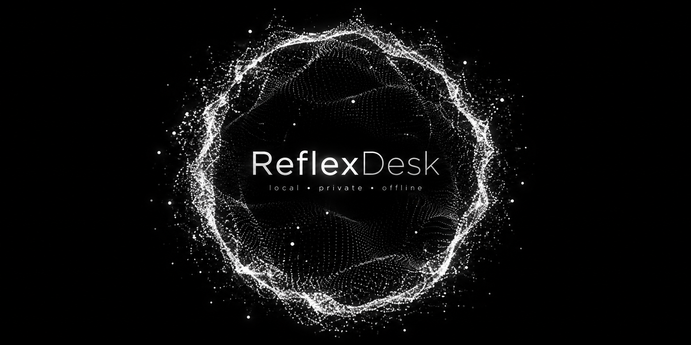

<p align="center">
  
</p>

<h1 align="center">⚡ ReflexDesk</h1>

<p align="center">
  <strong>Your computer, with reflexes.</strong><br/>
  Control your desktop, browser and AI agents with your voice — locally.
</p>

<p align="center">
  📴 Offline-first &nbsp;·&nbsp; 🔒 Private &nbsp;·&nbsp; ⚡ Fast path &nbsp;·&nbsp; 💻 Windows / macOS / Linux
</p>

---

## 🎙️ Say it. It happens.

> **“Open Spotify.”**  
> **“Search for the latest local AI models.”**  
> **“Run Codex on this repo.”**  
> **“Stop listening.”**

ReflexDesk does not wake a giant LLM for every click. Known commands take the fast deterministic path. Harder work escalates only when it needs to.

### ✨ What makes it different

After first-time setup, ReflexDesk behaves like a system utility: it starts hidden, lives in the tray, prepares the local engine in the background, and only accepts voice once the runtime is genuinely ready.

- ⚡ **Reflex path** — common commands execute without a generative LLM
- 🎧 **NVIDIA Nemotron 3.5** — local multilingual streaming ASR by default
- 🫧 **Live particle overlay** — transparent white particles move with your voice
- ⌨️ **Instant kill switch** — `Ctrl/Cmd + Shift + Space`
- 📴 **Offline after setup** — speech and routing can stay entirely on-device
- 🧠 **Configurable intelligence** — deterministic router, Laya, local planners
- 🤖 **Harness-aware** — Codex, OpenCode, Kilo, Claude Code, Gemini, ACP-ready architecture
- 🛡️ **Typed tools** — AI asks; ReflexDesk decides what is actually allowed

---

## 🫧 The Reflex

When ReflexDesk is listening, a semi-transparent particle orb floats above the desktop.

It is not decoration. Its motion and intensity follow microphone energy in real time, and it changes state while ReflexDesk is transcribing or an agent is working.

```text
Ctrl + Shift + Space      Windows / Linux
Cmd  + Shift + Space      macOS
```

Press once to listen. Press again to stop immediately.

**When ReflexDesk is off, the microphone tracks are explicitly stopped.** The local speech process may stay warm in memory, but it receives no audio.

---

## 🧠 Local stack

| Layer | Default | Job |
|---|---|---|
| 🎧 Speech | **NVIDIA Nemotron 3.5 ASR Streaming 0.6B** | multilingual speech → text |
| ⚙️ Runtime | **CrispASR** | native C++ / GGUF inference |
| ⚡ Reflex | deterministic router → optional Laya | instant known actions |
| 🧠 Planner | local OpenAI-compatible endpoint | novel multi-step tasks |
| 🤖 Harness | Codex / OpenCode / Kilo / Claude / Gemini | heavy agent work |

Nemotron downloads its local Q4_K runtime model on first voice use (~458 MB), then reuses the local cache.

Moonshine remains available as a lightweight fallback.

More details: [docs/STT.md](docs/STT.md)

---

## 🏎️ How it works

```text
Voice
  ↓
local VAD + Nemotron 3.5
  ↓
Known command? ── yes ──→ typed native tool ──→ done
  │
  no
  ↓
Laya / local planner
  ↓
tool or AI harness
```

The generative model is a fallback — **not the main loop**.

---

## 🚀 Run it

Requirements: Node 22+, Rust and the normal Tauri system dependencies.

```bash
git clone https://github.com/Maxei6/reflexdesk.git
cd reflexdesk
npm install
npm run dev
```

`npm run dev` prepares a pinned CrispASR runtime for your platform.

The first time you activate Nemotron, the model is downloaded to its local cache. After that, the speech path can run offline.

You can also test commands from the text box before microphone setup finishes.

---

## 📴 Offline means offline

In local mode:

```text
Microphone      → local
Speech-to-text  → local
Intent routing  → local
Planner         → localhost only
Desktop tools   → local
Config/history  → local
```

Remote planner endpoints are blocked unless **Hybrid** mode is explicitly enabled.

---

## 🤖 Control the agents you already use

ReflexDesk is not trying to replace every coding agent.

```text
"Run Codex on this repo and fix the tests."
"Open this project in OpenCode."
"Stop."
"Show me what changed."
```

The v0.1 bridge detects:

**OpenCode · Kilo · Codex · Claude Code · Gemini**

Structured ACP/SDK control and harness interrupt/resume are the target. UI scraping is intentionally the last resort.

---

## ✅ Already working

- first-run language + microphone + real voice readiness test
- background system-tray lifecycle
- start-at-login + single-instance protection
- durable settings + engine watchdog/recovery
- owned AI-process cleanup on explicit quit
- authenticated ephemeral localhost STT service
- Tauri desktop app
- transparent always-on-top overlay
- microphone-reactive particle animation
- global listen / kill shortcut
- NVIDIA Nemotron 3.5 local STT path
- automatic old-CPU fallback runtime on x86-64
- Moonshine fallback
- deterministic fast router
- optional local Laya adapter
- local / hybrid planner gate
- safe app + browser tools
- AI harness detection / launch
- Windows, macOS and Linux build pipelines

## 🔜 Next

- automatic Windows/Linux CUDA/Vulkan runtime selection after benchmark
- native accessibility trees
- browser DOM / CDP control
- full ACP harness adapters + interrupt / resume
- reusable learned skills
- signed / notarized installers

See [docs/P0.md](docs/P0.md) for the desktop lifecycle/security design and [docs/MVP.md](docs/MVP.md) for the exact current boundary.

---

## 📦 Build

```bash
npm run check
npm run build
```

GitHub Actions builds preview installers for Windows, macOS and Linux.

---

## 📜 License

ReflexDesk source code is **MIT**.

Model weights and third-party runtimes keep their own upstream licenses. See [THIRD_PARTY_NOTICES.md](THIRD_PARTY_NOTICES.md) and [models/registry.json](models/registry.json).
